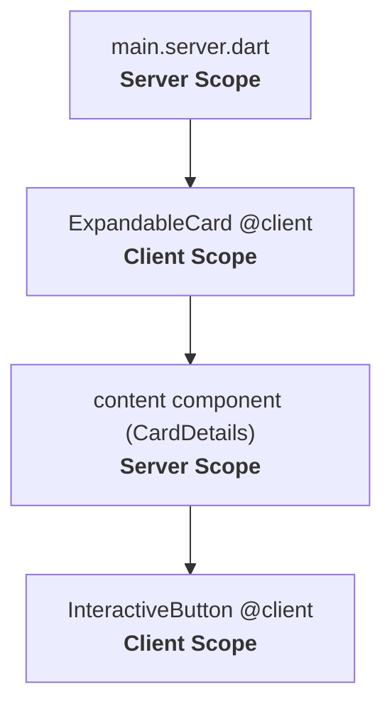

When building modern web applications, we want both rich, fluid interactivity and fast initial page loads. 

Typically, once you make a parent component interactive by decorating it with `@client`, Jaspr must compile it and **all of its nested children** to JavaScript so they can run in the browser. Without Server Components, the moment a layout or parent container needs some client-side interactivity, every single child in its subtree gets pulled into the client-side JavaScript bundle—even if those children are completely static.

**Server Components** solve this by enabling **surgical hydration**. They allow you to render server-side-only components inside parts of an interactive, hydrated client-side application. With this pattern, you can build interactive client-side wrappers (like expandable cards, navigation shells, sidebars, or tabs) while completely skipping compiling or shipping the static or heavy content inside them.

As a result:
- **Reduced Bundle Size:** The Dart code for server-only components is never compiled to JavaScript or shipped to the browser, significantly reducing the application's JavaScript footprint.
- **Surgical Interactivity:** You only ship the parts of the code to the client that actually need to be interactive, skipping parts that are static.
- **Faster Page Loading:** Less JavaScript to download, parse, and execute means much faster Time-to-Interactive (TTI) for your users.
- **Access to Server Resources:** The server components within the client wrapper can safely fetch database records or read files using native APIs like `dart:io`.

## How to use Server Component

It is important to understand that **Server Components are not a separate API** in Jaspr. There is no special annotation, and you don't need to inherit from a special class.

Instead, Server Components are a design paradigm enabled by Jaspr's compilation and hydration model. You achieve this simply by **passing components as parameters** (such as a `child` component, or lists/maps of components) to a component annotated with [`@client`](/api/utils/at_client).

## A Simple Example: Expandable Card

Let's build a client-side component called `ExpandableCard`. It features a button that lets users toggle the visibility of the card's content. To do this, the card must be interactive and annotated with `@client`. However, the content inside the card is static content that doesn't need client-side interactivity.

Here is the interactive card component:

```dart title="lib/components/expandable_card.dart"
import 'package:jaspr/jaspr.dart';

@client
class ExpandableCard extends StatefulComponent {
  const ExpandableCard({required this.title, required this.content, super.key});

  final String title;
  final Component content;

  @override
  State<ExpandableCard> createState() => _ExpandableCardState();
}

class _ExpandableCardState extends State<ExpandableCard> {
  bool isExpanded = false;

  @override
  Component build(BuildContext context) {
    return div(classes: 'card', [
      div(classes: 'card-header', [
        h3([.text(component.title)]),
        button(
          onClick: () => setState(() => isExpanded = !isExpanded),
          [.text(isExpanded ? 'Collapse' : 'Expand')],
        ),
      ]),
      // We toggle visibility using a CSS class (like display: none in styles).
      // This ensures the server component is rendered during SSR,
      // and can then be shown or hidden interactively on the client.
      div(
        classes: 'card-content ${isExpanded ? 'expanded' : 'collapsed'}',
        [component.content],
      ),
    ]);
  }
}
```

Here is how you use the `ExpandableCard` component on the server, passing in a server-only component as a parameter:

```dart title="lib/main.server.dart"
import 'package:jaspr/server.dart';
import 'components/expandable_card.dart';

void main() {
  Jaspr.initializeAll(options: defaultServerOptions);

  runApp(
    Document(
      title: 'My Dashboard',
      body: ExpandableCard(
        title: 'Server Component Info',
        content: div(classes: 'card-details', [
          p([.text('This content is static and rendered entirely on the server.')]),
          p([.text('It is not compiled to JavaScript or shipped to the browser.')]),
        ]),
      ),
    ),
  );
}
```

### Where is each part rendered?

Understanding where each component is built and executed is key to mastering this paradigm:

- **`Document`**: The root component of the server application. It is built and rendered **only on the server**.
- **`ExpandableCard` (@client Component)**: Built first on the server to generate the initial HTML, then **hydrated and executed on the client** to handle the expansion state and click events.
- **`ExpandableCard.content` parameter (`div` with static content)**: Evaluated and rendered to HTML on the server. The client-side framework receives this pre-rendered HTML DOM structure and simply mounts it at the correct position inside the hydrated `ExpandableCard`. The client browser never builds the `div` component or any of its children.

---

## Component Scopes

This rendering boundary behavior aligns directly with Jaspr's concept of **Component Scopes**. As described in [Server-Side Jaspr (Component Scopes)](/dev/server#component-scopes), your application is split into the **Server Scope** and the **Client Scope**.

Usually, once a component is in the Client Scope (by being nested inside a `@client` component), its entire subtree is also in the Client Scope and compiled to JavaScript. However, passing a component as a parameter to a `@client` component breaks this inheritance. It lets you transition parts of the subtree back into the Server Scope, creating alternating boundaries:



---

## Advanced Example: Tab Bar (List of Components)

You can also pass lists of components. For instance, a client-side `TabBar` that manages the active tab index, but renders the tab content panels entirely on the server.

Define the tabs client component:

```dart title="lib/components/tab_bar.dart"
import 'package:jaspr/jaspr.dart';

@client
class TabBar extends StatefulComponent {
  const TabBar({required this.children, super.key});

  final List<Component> children;

  @override
  State<TabBar> createState() => _TabBarState();
}

class _TabBarState extends State<TabBar> {
  int activeIndex = 0;

  @override
  Component build(BuildContext context) {
    return div([
      div(classes: 'tab-headers', [
        button(onClick: () => setState(() => activeIndex = 0), [.text('Home')]),
        button(onClick: () => setState(() => activeIndex = 1), [.text('Profile')]),
        button(onClick: () => setState(() => activeIndex = 2), [.text('Settings')]),
      ]),
      div(classes: 'tab-content', [
        // We render all children to ensure they are built and hydrated on the server,
        // and toggle their visibility on the client using CSS classes.
        for (var i = 0; i < component.children.length; i++)
          div(
            classes: 'tab-pane ${i == activeIndex ? 'active' : 'hidden'}',
            [component.children[i]],
          ),
      ]),
    ]);
  }
}
```

Used on the server:

```dart title="lib/main.server.dart"
TabBar(
  children: [
    HomeTabContent(),      // Renders on server
    ProfileTabContent(),   // Renders on server
    SettingsTabContent(),  // Renders on server
  ],
)
```

---

## Hydration & How it Works

The following happens behind the scenes to link these components:

1. **Pre-Rendering**: The server renders the root component tree downwards. When it encounters a `@client` component, the `ClientComponentAdapter` takes any component parameters (such as `content`), renders them to HTML, and registers a `ServerComponentAdapter`.
2. **Markers**: The server wraps the rendered output of the server component in HTML comment boundary markers:
   ```html
   <!--s@1-->
   <div>Server-rendered Card Details</div>
   <!--/s@1-->
   ```
3. **Serialization**: The parameters of the `@client` component are serialized into JSON in its start marker. The `content` parameter is encoded using the server component's ID: `data={"content":"s@1"}`.
4. **Hydration**: The browser parses the HTML and loads the JavaScript bundle. The client-side framework locates the client markers, decodes the parameters, and reads the server component boundary comments as `ServerComponentAnchor` nodes.
5. **Mounting**: When the client component builds and calls `params.mount('s@1')`, the framework matches the ID to the parsed anchor and returns a `SlottedChildView` pointing directly to the pre-rendered HTML DOM nodes, avoiding any client-side execution of the server component's build code.

---

## Nested Client Components

Server components are not limited to static content. A component inside a Server Component subtree can itself be annotated with `@client`. 

During hydration, Jaspr compiles and hydrates the nested client component as normal, letting you embed complex client-side interactivity inside server-rendered templates.

---

## Conditional Rendering during SSR

Because Server Components are executed only on the server, **they must be pre-rendered during the initial Server-Side Rendering (SSR) phase**. 

If a Server Component is passed to a client component but is not evaluated or rendered in the component's build method (for example, if it is placed inside an `if` block where the condition is `false` during the initial server render), it cannot be constructed later on the client:

```dart
@client
class ConditionalCard extends StatefulComponent {
  const ConditionalCard({required this.content, super.key});
  final Component content;

  @override
  State<ConditionalCard> createState() => _ConditionalCardState();
}

class _ConditionalCardState extends State<ConditionalCard> {
  bool showContent = false; // Evaluates to false on the server

  @override
  Component build(BuildContext context) {
    return div([
      button(onClick: () => setState(() => showContent = true), [Text('Reveal')]),
      // WARNING: If showContent is false during SSR, 'widget.content' is not built on the server.
      // When showContent becomes true on the client, it will render as EMPTY because 
      // the client does not have the Dart code to construct the server component.
      if (showContent) widget.content, 
    ]);
  }
}
```

Always ensure that any Server Components passed as parameters are rendered/evaluated during the initial server-side build. If you need conditional visibility on the client, control it using CSS (e.g. `display: none`) or wrap the content in a client-side component instead.
