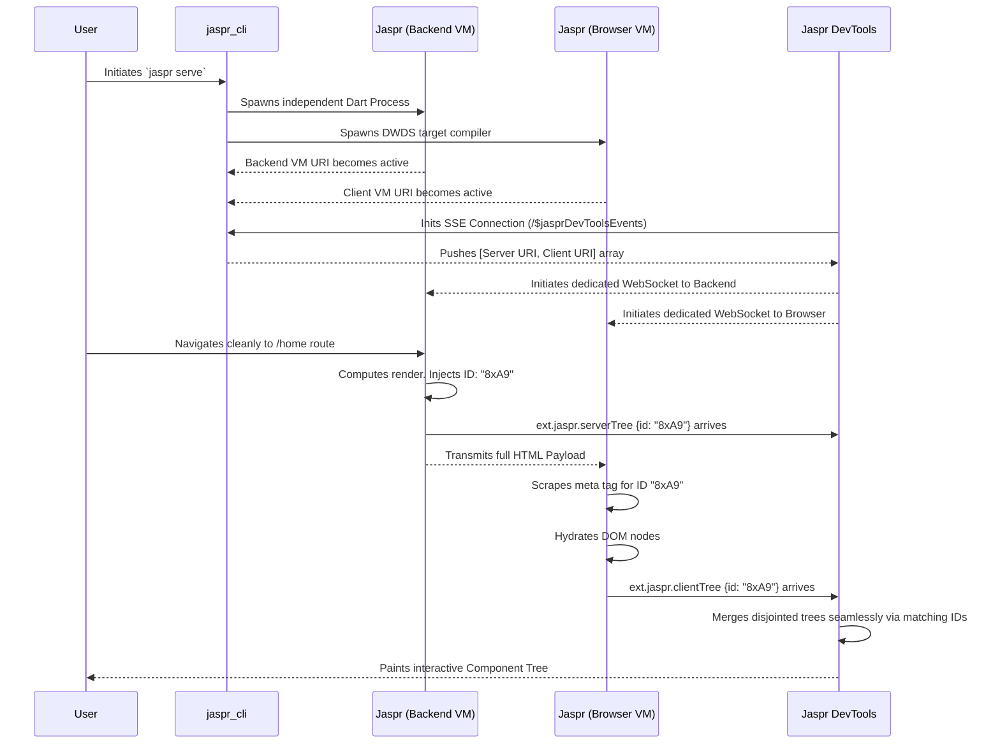

# Jaspr DevTools Architecture & System Design

This document details the architecture of the Jaspr DevTools ecosystem, covering integration, serving, and communication for inspecting server-rendered and client-hydrated component trees.

---

## System Context

Jaspr DevTools provides a visual interface for inspecting Jaspr applications, similar to Flutter DevTools. Since Jaspr applications span both the server (Dart VM) and the browser (JavaScript/Wasm), DevTools coordinates data from multiple Dart VM instances into a unified tree view.

The ecosystem relies on three pillars:
1. **The DevTools Application (`jaspr_devtools`)**: The standalone visual interface that developers interact with.
2. **The Command Line Interface (`jaspr_cli`)**: The orchestrator that serves the DevTools and securely bridges connection data.
3. **The Core Framework (`jaspr`)**: The active framework tracking element lifecycles and broadcasting diagnostic events.

---

## 1. The DevTools Application

### Architecture Profile
`jaspr_devtools` is a standard Jaspr application configured strictly as a client-side app. It requires no server-side rendering.

### Distribution and Build Process
`jaspr_devtools` is not published to `pub.dev` as a standalone dependency. Instead, it is compiled into static web assets (`jaspr build`), and the resulting `build/web/` directory is bundled into `jaspr_cli` at `lib/src/devtools/web/`.

When users run `jaspr serve`, the DevTools interface is automatically served locally. This prevents developers from needing to add DevTools to their project's `pubspec.yaml`.

### User Interface Design
The modular UI leverages Jaspr components and nested CSS, divided into three conceptual areas:
*   **Global Layout**: A persistent sidebar for navigating inspector scopes.
*   **Tree Inspector**: A tabbed visualizer tracking URL paths and rendering the hierarchical node map.
*   **Property Panels**: A resizable split-view displaying diagnostic variables and state for the selected node.

### Service Layer and WebSocket Connections
The UI maintains active WebSocket connections to the host's Dart VM Services.

On startup, DevTools connects to the `/$jasprDevToolsEvents` SSE endpoint to receive dynamic WebSocket URIs for the Server VM and Client VM. Once received, it establishes two concurrent `package:vm_service` connections and listens to their `Extension` streams for custom diagnostic events.

---

## 2. Command Line Interface Integration

The CLI acts as a proxy, serving DevTools assets and routing VM information.

### Serving the Inspector
Running `jaspr serve` initializes a `DevToolsController`. By default, the CLI serves the bundled static assets from `lib/src/devtools/web/` via `shelf_static`.

For maintainers developing DevTools, setting the `JASPR_DEVTOOLS_PROXY` environment variable bypasses the static files, proxying requests to a live local DevTools instance to support hot-reloading.

### Bridging VM Information
Dart VM service URIs are dynamically generated to prevent port conflicts, so DevTools cannot rely on hardcoded URIs.

To resolve this, the CLI hosts an SSE handler. When booting the backend process and the web DWDS compiler, the CLI captures their debug observatory endpoints. It feeds these to the `DevToolsController`, which broadcasts the `serverVmServiceUri` and `clientVmServiceUri` down to the DevTools frontend.

---

## 3. Core Framework Integration

The `jaspr` framework evaluates element lifecycles and broadcasts diagnostics to the DevTools.

### Diagnostics Serialization
The framework uses `DiagnosticsNode` to track element names, identifiers, properties, and children. Calling `.toJsonMap()` serializes this complex Dart tree into a simple map:

```dart
// Conceptual Example of a serialized component diagnostic
{
  "name": "ButtonComponent",
  "properties": {
    "disabled": false,
    "label": "Submit"
  },
  "children": [
    { "name": "Text", "properties": {"value": "Submit"} }
  ]
}
```

This isolates the framework logic from transport serialization.

### Server-Side Lifecycle
During HTML generation, the server binding constructs the element tree and generates a random `jaspr-devtools-id`.

It injects this ID into the DOM as a `<meta name="jaspr-devtools-id" content="[ID]"/>` tag in the document head. It then fires `postEvent('ext.jaspr.serverTree')`, allowing DevTools to immediately inspect the serialized server tree.

### Client-Side Hydration
When the browser boots Jaspr, the client binding delays diagnostic reporting until all lazy-loaded builders finalize.

It then parses the `jaspr-devtools-id` meta tag to associate itself with the server render. Post-hydration, it evaluates the client component tree and fires `postEvent('ext.jaspr.clientTree')`.

### The DevToolbar Overlay
During development runs, `jaspr` injects a DevToolbar overlay into the application. Clicking this floating button opens the DevTools visualizer pointing to the CLI's internally hosted path.

---

## 4. In-App Inspector Infrastructure

To achieve deep interactivity similar to Flutter DevTools, the Jaspr framework embeds specialized inspector infrastructure directly within the running application during development.

### The `DevToolsService`
Rather than continuously broadcasting full diagnostic trees on every rebuild, advanced inspection tasks are handled by a singleton `DevToolsService` running inside the user's application.

*   **Object Caching & Identity:** The service intercepts component evaluations and caches `DiagnosticsNode` representations, identifying them with lightweight lifecycle IDs (e.g., `i-452`). This prevents garbage collection blockages and allows the DevTools UI to request subtrees by ID rather than requesting the entire DOM model.
*   **Service Extensions:** It exposes RPC callbacks via `dart:developer` meant specifically for the UI.
    *   `ext.jaspr.inspector.getRoot`: Returns the ID of the root node.
    *   `ext.jaspr.inspector.getChildren`: Accepts a node ID and returns only that subset of children.
    *   `ext.jaspr.inspector.setSelection`: Directs the DevTools UI to focus on a designated ID.
*   **Event Emitting:** Handles firing `postEvent('navigate')` payloads that seamlessly instruct modern IDE plugins to open the dart file and line number corresponding to an active selection.

```dart
// Conceptual DevToolsService Architecture
class DevToolsService {
  static final instance = DevToolsService();
  final Map<String, Element> _idToElement = {};
  final ValueNotifier<bool> isSelectMode = ValueNotifier(false);
  
  void initServiceExtensions() {
    registerExtension('ext.jaspr.inspector.setSelection', (method, parameters) async {
       final id = parameters['id'];
       final element = _idToElement[id];
       if (element != null) {
          // Highlight DOM node logically and notify IDEs
       }
       return ServiceExtensionResponse.result(jsonEncode({'success': true}));
    });
  }
}
```

### The `JasprDevToolbar`
Operating as the visual front-door to the Inspector, the `JasprDevToolbar` is a top-level overlay component that wraps the `AppBinding` purely when `kDebugMode` is true.

**Toolbar Interface and Features:**
Rather than a single floating button, the DevToolbar renders as an affixable floating menu bar overlay layered strictly above the application. It provides:
1.  **Inspector Toggle:** A primary button to activate or deactivate the "Select Mode" targeting crosshairs. 
2.  **Settings Menu:** A secondary menu button that expands a small contextual settings pane allowing the developer to:
    *   Change the toolbar's docking position (top, right, bottom, left).
    *   Toggle verbose framework logging on and off.
    *   Disable and hide the toolbar entirely for the duration of the current session.

**Select Mode Interception:**
When "Select Mode" is toggled on (bound directly to `DevToolsService.instance.isSelectMode`), the toolbar mounts a global capture-phase event listener for both `mouseover` and `click`. 
By executing `e.preventDefault()` and `e.stopPropagation()` aggressively, the overlay intercepts physical interactions, paralyzing normal frontend routing/behavior to allow pure DOM inspection without triggering application side effects.

**DOM-to-Element Translation:**
Because physical DOM interactions (`mouseover`, `click`) naturally trigger on raw browser native `web.Node` targets, Jaspr must map these back to their originating Dart `Element`. Rather than polluting the raw DOM structure with JS interop properties, the framework securely tracks this during `kDebugMode` using a Dart `Expando<Element>`. 

As `DomRenderObject`s hydrate or generate physical nodes, they register themselves into this `Expando`. When an interception occurs, the toolbar passes the raw `web.Node` into the `Expando` mapping to instantly resolve the Dart framework element. It then translates the absolute HTML bounding box of the node into a floating CSS highlight layer projecting over the viewport.

```dart
// Conceptual snippet highlighting the active selection interception logic
void _handleGlobalClick(web.MouseEvent e) {
  if (!DevToolsService.instance.isSelectMode.value) return;
  
  // Halt underlying application interactions
  e.preventDefault();
  e.stopPropagation();
  
  // O(1) lookup natively resolving the Jaspr Element via Expando
  final targetNode = e.target as web.Node;
  final element = DevToolsService.instance.domRegistry[targetNode];
  
  if (element != null) {
      // Route selection payload back to the DevTools UI and exit select mode
      DevToolsService.instance.selectElement(element);
      DevToolsService.instance.isSelectMode.value = false; 
  }
}
```

---

## 5. Workflows and Component Matching

The interplay of WebSockets, proxying, and multiple VMs requires a reliable tracking strategy.

### End-to-End Sequence



### Advanced Component Tree Matching Strategy
Verifying that the server's output exactly matches the client's hydration target is critical. The DevTools solves this utilizing three phases:

1. **Tabbed Route Isolation**: Internal trees are grouped into specialized state objects keyed by their absolute URL route.
2. **Deterministic Correlation**: The transmission of the `jaspr-devtools-id` across both VMs pairs corresponding Server and Client renders.
3. **Mismatched Visualization**: Differences between the generated properties (e.g., responsive parameters) are highlighted in the UI using deep diffing.
