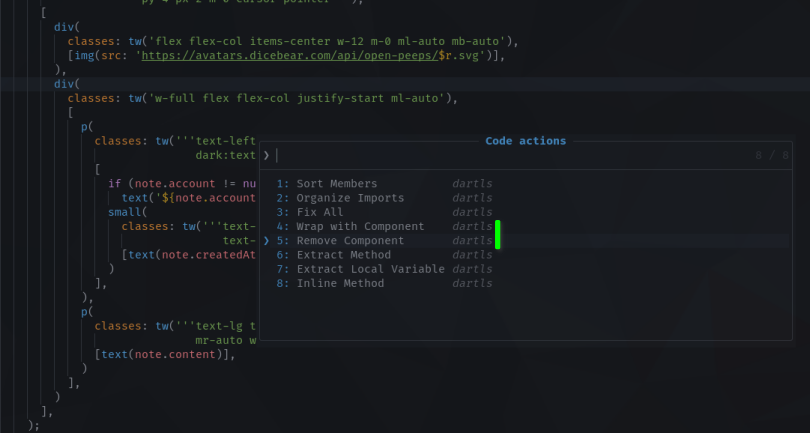

# Jaspr Lints

This package provides lints and code assists for users of the Jaspr framework.

### Features:
* Remove components from the compent tree
* Add components tp the component tree
* More to come

### Setup:

* The application must contain an `analysis_options.yaml` with the following:
```yaml
analyzer:
  plugins:
    - custom_lint
```

* Add `custom_lint` and `jaspr_lints` as dev dependency:
```yaml
name: example_app
environment:
  sdk: ">=2.16.0 <3.0.0"

dev_dependencies:
  custom_lint: <version>
  jaspr_lints: <version>
```
After running pub get you now see additional Jaspr lints when invoking code assist on a component function like `div()` or `p()` files:


